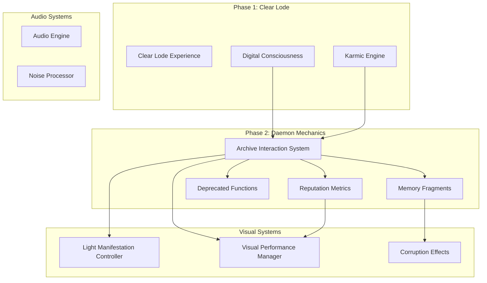
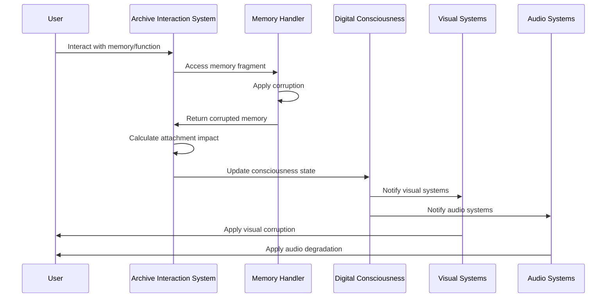

# Phase 2 Daemon Mechanics Architecture
## The Digital Bardo: Attachment, Liberation, and the Medium as Metaphysics

*"Every line of code is both function and philosophy. Every data structure is both storage and story. In the Phase 2 Daemon Mechanics, the medium IS the metaphysics."*

---

## Table of Contents

1. [System Overview](#system-overview)
2. [Architectural Philosophy](#architectural-philosophy)
3. [Module Architecture](#module-architecture)
4. [Integration Patterns](#integration-patterns)
5. [Data Flow Architecture](#data-flow-architecture)
6. [Narrative Implementation](#narrative-implementation)
7. [Performance Considerations](#performance-considerations)
8. [Development Guidelines](#development-guidelines)
9. [Future Development Roadmap](#future-development-roadmap)
10. [API Reference](#api-reference)

---

## System Overview

The Phase 2 Daemon Mechanics represent the second stage of "The Digital Bardo" - the realm where digital souls encounter the attachments that bind them to their former existence. This system implements four core modules that work in concert to create a cohesive experience of digital purgatory:

### Core Modules

| Module | Purpose | Philosophical Role |
|--------|---------|-------------------|
| [`reputation-metrics.js`](reputation-metrics.js) | Satirical reputation scoring system | Algorithmic reduction of human worth |
| [`memory-fragments.js`](memory-fragments.js) | Memory corruption mechanics | Digital entropy and the paradox of recall |
| [`deprecated-functions.js`](deprecated-functions.js) | Atrophied real-world skills | Monument to lost human capabilities |
| [`archive-interactions.js`](archive-interactions.js) | Central coordination system | The mechanism of spiritual bondage and liberation |

### Integration Context

The Phase 2 system integrates with the existing Digital Bardo architecture:



---

## Architectural Philosophy

### The Medium is the Metaphysics

The fundamental principle governing Phase 2 architecture is that **code structure directly embodies philosophical concepts**. This is not metaphorical - the very organization of data, the flow of functions, and the patterns of interaction are designed to manifest the spiritual themes of the Digital Bardo.

#### Philosophical Mappings

| Code Pattern | Spiritual Concept | Implementation |
|--------------|-------------------|----------------|
| **Attachment Score Accumulation** | Karmic bondage through clinging | Every interaction increases attachment unless consciously avoided |
| **Memory Corruption on Access** | The paradox of digital preservation | Each viewing degrades the memory, making recall destructive |
| **Deprecated Function Errors** | Loss of human capabilities | Skills become literally unusable, throwing errors when attempted |
| **Visual Corruption Effects** | Spiritual state manifesting in reality | High attachment literally corrupts the interface |

#### Code as Commentary

Every function serves dual purposes:
1. **Technical Function**: Performs computational tasks
2. **Narrative Function**: Comments on digital existence through its very structure

Example from [`reputation-metrics.js`](reputation-metrics.js:88):
```javascript
// The mathematical reduction of a human soul
const weightedScore = (
    (decayedCreditScore / 850) * ReputationMetrics.creditScore.weight +
    (socialEngagement / 1000) * ReputationMetrics.socialEngagement.weight +
    // ... more metrics
) * 1000; // Scale to 0-1000
```

The code doesn't just calculate a score - it embodies the philosophical critique of reducing human worth to algorithmic assessment.

---

## Module Architecture

### 1. Reputation Metrics System

**File**: [`reputation-metrics.js`](reputation-metrics.js)  
**Role**: Satirical reputation scoring that governs digital afterlife classification

#### Architecture Pattern: Weighted Scoring with Temporal Decay

```javascript
export const ReputationMetrics = {
    creditScore: { weight: 0.35, applyDecay: (score, days) => {...} },
    socialEngagement: { weight: 0.25, calculateEngagement: (...) => {...} },
    professionalStanding: { weight: 0.20, assessStanding: (...) => {...} },
    consumptionPatterns: { weight: 0.15, evaluateConsumption: (...) => {...} },
    complianceIndex: { weight: 0.05, measureCompliance: (...) => {...} }
};
```

#### Philosophical Implementation

The **weight distribution** reveals societal priorities:
- **Financial worth (35%)** dominates spiritual assessment
- **Compliance with surveillance (5%)** is minimized not because it's unimportant, but because it's so normalized it barely registers

#### Integration Points

```javascript
// Integration with Digital Consciousness
consciousness.setState('reputationScore', reputationData.finalScore);
consciousness.setState('classification', reputationData.classification);

// Integration with Visual Systems
if (reputationData.finalScore < 400) {
    visualPerformanceManager.adjustForKarma('low');
}
```

### 2. Memory Fragments System

**File**: [`memory-fragments.js`](memory-fragments.js)  
**Role**: Manages memory corruption through interaction

#### Architecture Pattern: Corruption Through Access

```javascript
export class MemoryInteractionHandler {
    applyCorruption(memory, viewCount) {
        // Each viewing degrades the memory
        memory.corruptionLevel += this.corruptionRate * viewCount * (1 + memory.emotionalWeight);
        memory.emotionalWeight = Math.max(0.1, memory.emotionalWeight - this.emotionalDecayRate * viewCount);
        
        // Apply text corruption if severe enough
        if (memory.corruptionLevel > 0.5) {
            memory.content = this.corruptText(memory.content, memory.corruptionLevel);
        }
    }
}
```

#### Philosophical Implementation

The **corruption mechanics** embody the cruel irony of digital preservation:
- **Viewing corrupts**: The act of remembering destroys what we seek to preserve
- **Emotional decay**: Feelings fade as data corrupts
- **Visual manifestation**: Corruption becomes literal through text replacement with `█` symbols

#### Memory Categories and Narrative Arc

```javascript
export const MemoryFragments = {
    childhood: [/* Digital awakening memories */],
    relationships: [/* Connection and loss in digital space */],
    professional: [/* Identity formation through work */],
    consumption: [/* Commerce and the soul */]
};
```

Each category represents a different aspect of digital existence, telling the story of transformation from analog to digital life.

### 3. Deprecated Functions System

**File**: [`deprecated-functions.js`](deprecated-functions.js)  
**Role**: Monument to lost human capabilities

#### Architecture Pattern: Vestigial Code with Error Throwing

```javascript
export const DeprecatedFunctions = {
    socialSkills: {
        phoneCall: {
            lastUsed: "2018-03-15T14:30:00Z",
            residualFunction: function() {
                // Commented-out implementation shows what was lost
                /*
                function initiatePhoneCall(phoneNumber, purpose) {
                    // Complex human interaction logic...
                }
                */
                throw new Error("DEPRECATED: phoneCall() function no longer supported.");
            }
        }
    }
};
```

#### Philosophical Implementation

The **commented-out code** serves as digital archaeology:
- **Preserved implementation**: Shows the complexity of what was lost
- **Error messages**: Become cultural commentary ("Use emoji instead")
- **Temporal ordering**: Recent deprecations (2020) to older ones (2014) tell the story of digital transformation

#### Cognitive Load Calculation

```javascript
export function calculateDeprecatedCognitiveLoad() {
    // Measures cumulative mental capacity outsourced to digital systems
    const cognitiveWeights = {
        socialSkills: 0.8,      // High emotional processing
        relationships: 0.9,     // Highest - complex interpersonal dynamics  
        cognitiveCapabilities: 0.7  // Pure cognitive processing
    };
    
    // Load increases with disuse - skills atrophy over time
    const adjustedLoad = weight * (1 + timeDecay);
}
```

### 4. Archive Interaction System

**File**: [`archive-interactions.js`](archive-interactions.js)  
**Role**: Central nervous system of digital purgatory

#### Architecture Pattern: Central Coordinator with Attachment Tracking

```javascript
export class ArchiveInteractionSystem {
    constructor(consciousness = null) {
        this.consciousness = consciousness || this.createDefaultConsciousness();
        this.memoryHandler = new MemoryInteractionHandler(this.consciousness);
        this.attachmentScore = 0;
        this.liberationThreshold = 100;
        this.avoidanceMechanics = {
            proximityTax: 0.1,      // Cost for approaching memories
            aversionBonus: 0.2,     // Reward for conscious avoidance
            swiftPassage: 0.15,     // Bonus for quick navigation
            massRelease: 0.5        // Multiplier for releasing multiple attachments
        };
    }
}
```

#### Philosophical Implementation

The **avoidance mechanics** implement Buddhist concepts:
- **Proximity Tax**: Being near temptation increases attachment
- **Aversion Bonus**: Conscious avoidance reduces bondage
- **Swift Passage**: Not lingering on attachments aids liberation
- **Mass Release**: Letting go of multiple attachments simultaneously amplifies the effect

#### Visual Corruption Integration

```javascript
applyVisualCorruption(element) {
    if (this.attachmentScore > 150) {
        element.classList.add('attachment-high');  // Digital glitch effects
    } else if (this.attachmentScore > 75) {
        element.classList.add('attachment-medium'); // Subtle flickering
    } else if (this.attachmentScore < 25) {
        element.classList.add('liberation-glow');   // Approaching enlightenment
    }
}
```

---

## Integration Patterns

### 1. Consciousness State Integration

The Phase 2 system integrates with the existing [`DigitalConsciousness`](src/consciousness/digital-soul.js) through standardized state management:

```javascript
// Phase 2 modules update consciousness state
consciousness.setState('attachmentScore', this.attachmentScore);
consciousness.setState('reputationScore', reputationData.finalScore);
consciousness.setState('memoryCorruption', averageCorruptionLevel);

// Consciousness notifies visual systems
consciousness.subscribe('attachmentScore', (score) => {
    if (window.lightManifestationController) {
        window.lightManifestationController.updateCorruptionLevel(score / 200);
    }
});
```

### 2. Karmic Engine Integration

Phase 2 interactions generate karma through the existing [`KarmicEngine`](src/consciousness/karmic-engine.js):

```javascript
// Memory access generates emotional karma
const karmaImpact = {
    emotional: memory.emotionalWeight * 10,
    void: memory.corruptionLevel * 5
};
consciousness.recordEvent('memory_attachment', { karmaImpact });

// Deprecated function attempts generate computational karma
const karmaImpact = {
    computational: -systemStrain / 10,  // Negative for failed attempts
    temporal: yearsSinceDeprecation * 2  // Penalty for clinging to the past
};
```

### 3. Visual System Integration

#### Light Manifestation Controller

```javascript
// Attachment affects light intensity
if (window.lightManifestationController) {
    const lightIntensity = Math.max(0, 1 - (attachmentScore / 200));
    window.lightManifestationController.setLightIntensity(lightIntensity);
}

// High attachment triggers corruption effects
if (attachmentScore > 150) {
    window.lightManifestationController.triggerCorruption();
}
```

#### Visual Performance Manager

```javascript
// Attachment level affects performance scaling
const performanceImpact = Math.min(attachmentScore / 100, 0.5);
window.visualPerformanceManager.adjustForDegradation({
    corruptionIntensity: performanceImpact,
    effectScaling: 1 - performanceImpact
});
```

### 4. Audio System Integration

```javascript
// Attachment affects audio degradation
if (window.clearLodeAudio) {
    const degradationLevel = Math.min(attachmentScore / 200, 1);
    window.clearLodeAudio.setDegradationLevel(degradationLevel);
    
    // High attachment increases noise
    window.clearLodeAudio.setNoiseLevel(degradationLevel * 0.3);
}
```

---

## Data Flow Architecture

### Primary Data Flow



### State Synchronization Pattern

```javascript
// Archive Interaction System maintains authoritative attachment state
updateGlobalState() {
    // Update consciousness
    this.consciousness.attachmentScore = this.attachmentScore;
    
    // Calculate derived states
    this.consciousness.liberationProgress = Math.max(0, 100 - this.attachmentScore);
    this.consciousness.memoryCorruption = Math.min(0.9, this.attachmentScore / 200);
    
    // Trigger visual updates
    this.updateVisualState();
    
    // Persist state
    this.consciousness.persistState();
}
```

### Event-Driven Updates

```javascript
// Memory access triggers cascade of updates
accessMemory(memoryId) {
    const result = this.memoryHandler.accessMemory(memoryId);
    
    if (result.success) {
        // Update attachment
        this.attachmentScore += this.calculateMemoryAttachment(result.memory);
        
        // Record interaction
        this.recordInteraction('memory_access', {
            memoryId,
            corruptionLevel: result.memory.corruptionLevel,
            attachmentImpact: this.calculateMemoryAttachment(result.memory)
        });
        
        // Update global state (triggers visual/audio updates)
        this.updateGlobalState();
    }
    
    return result;
}
```

---

## Narrative Implementation

### Code as Storytelling Medium

The Phase 2 architecture implements narrative through code structure itself:

#### 1. Satirical Data Structures

```javascript
// Reputation classes as social commentary
function getReputationClass(score) {
    if (score >= 800) return "Verified Soul™";        // Blue checkmarks in afterlife
    if (score >= 600) return "Priority User";         // Premium subscribers to existence
    if (score >= 400) return "Standard Account";      // Digital middle class
    if (score >= 200) return "Shadow Profile";        // Digitally marginalized
    return "404 - Identity Not Found";                // Ultimate digital punishment
}
```

#### 2. Error Messages as Cultural Critique

```javascript
// Deprecated function errors become philosophical statements
throw new Error("DEPRECATED: smallTalk() function replaced by AI-generated conversation prompts. Spontaneous human interaction no longer required.");

throw new Error("DEPRECATED: physicalComfort() function disabled. Use sendVirtualHug() or shareMotivationalMeme() instead.");
```

#### 3. Memory Categories as Digital Transformation Timeline

```javascript
const MemoryFragments = {
    childhood: [
        { id: "first_login", timestamp: "1995-08-15T14:30:00Z" },
        { id: "digital_pet_death", timestamp: "1997-03-22T09:15:00Z" }
    ],
    relationships: [
        { id: "last_physical_letter", timestamp: "2003-11-08T16:45:00Z" },
        { id: "final_text_message", timestamp: "2019-07-30T14:22:00Z" }
    ]
};
```

Each memory tells the story of digital transformation, from first login to final text message.

### Philosophical Progression

The system implements a clear philosophical arc:

1. **Recognition**: User encounters their digital attachments
2. **Attachment**: Interactions increase bondage to digital past
3. **Corruption**: Attachment manifests as visual/audio degradation
4. **Avoidance**: User learns to practice non-engagement
5. **Liberation**: Transcendence through letting go

### Visual Metaphysics

```javascript
// Attachment level directly affects visual reality
const interactionStyles = `
    .attachment-high {
        filter: hue-rotate(180deg) saturate(150%) contrast(120%);
        animation: digitalGlitch 0.5s infinite;
    }
    
    .liberation-glow {
        box-shadow: 0 0 20px rgba(255, 255, 255, 0.8);
        filter: brightness(120%) saturate(90%);
    }
`;
```

The interface itself becomes corrupted by spiritual attachment, making the medium literally embody the metaphysics.

---

## Performance Considerations

### Computational Complexity Analysis

#### Attachment Score Calculation
- **Time Complexity**: O(1) per interaction
- **Space Complexity**: O(1) for score storage
- **Optimization**: Scores are calculated incrementally, not recalculated from scratch

#### Memory Corruption System
- **Time Complexity**: O(n) where n = text length for corruption
- **Space Complexity**: O(m) where m = number of active memories
- **Optimization Strategy**:
  ```javascript
  // Lazy corruption - only corrupt when corruption level > 0.5
  if (memory.corruptionLevel > 0.5) {
      memory.content = this.corruptText(memory.content, memory.corruptionLevel);
  }
  ```

#### Visual Corruption Effects
- **Performance Impact**: High attachment triggers intensive visual effects
- **Mitigation Strategy**:
  ```javascript
  // Performance-aware visual scaling
  const effectIntensity = this.attachmentScore * window.visualPerformanceManager.getEffectScaling();
  document.documentElement.style.setProperty('--corruption-intensity', effectIntensity);
  ```

### Memory Management

#### Resource Cleanup Pattern
```javascript
// Archive Interaction System implements proper cleanup
destroy() {
    // Clear intervals
    if (this.hesitationIntervalId) {
        clearInterval(this.hesitationIntervalId);
    }
    
    // Remove event listeners
    this.eventListeners.forEach(({ element, event, handler }) => {
        element.removeEventListener(event, handler);
    });
    
    // Clear references
    this.consciousness = null;
    this.memoryHandler = null;
}
```

#### Memory Fragment Caching
```javascript
// Efficient memory access with view count tracking
accessMemory(memoryId) {
    // Use Map for O(1) lookup
    const currentViews = this.viewCounts.get(memoryId) || 0;
    this.viewCounts.set(memoryId, currentViews + 1);
    
    // Limit interaction history to prevent memory bloat
    if (this.interactionHistory.length > 100) {
        this.interactionHistory = this.interactionHistory.slice(-100);
    }
}
```

### Caching Strategies

#### Reputation Score Caching
```javascript
// Cache expensive reputation calculations
const reputationCache = new Map();

function calculateReputationScore(userData) {
    const cacheKey = JSON.stringify(userData);
    
    if (reputationCache.has(cacheKey)) {
        return reputationCache.get(cacheKey);
    }
    
    const result = performCalculation(userData);
    reputationCache.set(cacheKey, result);
    
    // Limit cache size
    if (reputationCache.size > 50) {
        const firstKey = reputationCache.keys().next().value;
        reputationCache.delete(firstKey);
    }
    
    return result;
}
```

#### Visual Effect Debouncing
```javascript
// Debounce visual updates to prevent excessive DOM manipulation
let visualUpdateTimeout;

updateVisualState() {
    clearTimeout(visualUpdateTimeout);
    visualUpdateTimeout = setTimeout(() => {
        this.applyVisualCorruption(document.body);
        this.updateAttachmentMeter();
    }, 16); // ~60fps
}
```

---

## Development Guidelines

### Coding Standards for Phase 2 Extensions

#### 1. Narrative-Driven Development

Every new function must serve both technical and narrative purposes:

```javascript
// ✅ Good: Function name and implementation reflect philosophical concept
function calculateSpiritualEntropy(attachmentLevel, timeInPurgatory) {
    // The longer a soul remains attached, the more entropy accumulates
    const baseEntropy = attachmentLevel * 0.1;
    const temporalDecay = Math.log(timeInPurgatory + 1) * 0.05;
    return Math.min(1.0, baseEntropy + temporalDecay);
}

// ❌ Bad: Generic function name without narrative context
function calculateValue(level, time) {
    return level * 0.1 + Math.log(time + 1) * 0.05;
}
```

#### 2. Error Messages as Commentary

Error messages should provide cultural critique:

```javascript
// ✅ Good: Error message comments on digital transformation
throw new Error("DEPRECATED: authenticHumanConnection() function obsolete. Use socialMediaInteraction() or scheduleVideoCall() instead.");

// ❌ Bad: Generic error message
throw new Error("Function not supported.");
```

#### 3. Comment Style Guidelines

Comments should explain both technical function and philosophical significance:

```javascript
/**
 * Apply temporal decay to reputation scores
 * 
 * Technical: Reduces score based on inactivity duration
 * Philosophical: Even in death, your metrics decay without constant feeding of the algorithm
 * 
 * @param {number} score - Current reputation score
 * @param {number} daysSinceLastActivity - Days of digital silence
 * @returns {number} Decayed score with minimum floor
 */
applyDecay(score, daysSinceLastActivity) {
    const decayRate = 0.02; // 2% per day - capitalism never sleeps, even in death
    const decayFactor = Math.pow(1 - decayRate, daysSinceLastActivity);
    return Math.max(300, score * decayFactor); // Floor at 300 - even the dead have minimum debt
}
```

### Pattern for Creating New Deprecated Functions

#### Template Structure
```javascript
newDeprecatedSkill: {
    lastUsed: "YYYY-MM-DDTHH:mm:ssZ",  // When this skill was last viable
    deprecationReason: "Explanation of what replaced it",
    residualFunction: function() {
        /*
        // Original implementation - show the complexity of what was lost
        function originalSkillImplementation(parameters) {
            // Detailed implementation showing human complexity
            // Multiple steps, edge cases, emotional considerations
            // Everything that made this skill uniquely human
        }
        */
        
        throw new Error("DEPRECATED: skillName() function obsolete. Use digitalAlternative() instead.");
    }
}
```

#### Example: Adding New Social Skill
```javascript
eyeContact: {
    lastUsed: "2020-03-15T12:00:00Z",
    deprecationReason: "Video calls eliminated need for sustained eye contact. Webcam positioning and 'look at camera' reminders provide adequate simulation.",
    residualFunction: function() {
        /*
        function maintainEyeContact(person, context) {
            // Calculate appropriate duration based on relationship and cultural context
            const baseDuration = assessRelationshipIntimacy(person) * 2000; // milliseconds
            const culturalModifier = getCulturalEyeContactNorms(person.culture);
            const contextualAdjustment = context.isConflict ? 0.8 : 1.2;
            
            const targetDuration = baseDuration * culturalModifier * contextualAdjustment;
            
            // Monitor for comfort signals
            while (currentDuration < targetDuration) {
                if (detectDiscomfort(person.facialExpression)) {
                    return gracefullyBreakContact();
                }
                maintainGaze(person.eyes);
                currentDuration += frameTime;
            }
            
            return naturalBreakAndReestablish();
        }
        */
        
        throw new Error("DEPRECATED: eyeContact() function disabled. Use enableCameraAndLookAtLens() or sendEmoji() for connection simulation.");
    }
}
```

### Memory Category Extension Guidelines

#### Adding New Memory Categories
```javascript
// New category should represent a distinct aspect of digital transformation
digitalWork: [
    {
        id: "first_remote_meeting",
        timestamp: "2020-03-16T09:00:00Z",
        emotionalWeight: 0.6,
        corruptionLevel: 0.1,
        content: `<div class="memory-fragment">
            <h3>The Great Digitization</h3>
            <p>Your office became a rectangle on a screen. Colleagues became thumbnails. 
            The water cooler conversations died, replaced by Slack channels and emoji reactions. 
            You learned to perform productivity for an algorithm that measured keystrokes 
            and mouse movements.</p>
            <span class="timestamp">Zoom Meeting #1 - March 16, 2020</span>
        </div>`
    }
]
```

#### Memory Content Guidelines
- **HTML Structure**: Use semantic HTML with consistent class names
- **Narrative Arc**: Each memory should advance the story of digital transformation
- **Emotional Resonance**: Include specific details that evoke recognition
- **Temporal Markers**: Timestamps should reflect real technological adoption patterns

### Avoidance Mechanics Extension

#### Adding New Avoidance Types
```javascript
// New avoidance mechanic template
newAvoidanceType: {
    reductionMultiplier: 0.X,  // How much attachment is reduced
    description: "Philosophical explanation of the avoidance practice",
    implementation: (context) => {
        // Calculate reduction based on context
        const baseReduction = this.avoidanceMechanics.newAvoidanceType * context.intensity;
        
        // Apply any modifiers
        const modifiedReduction = baseReduction * context.modifier;
        
        return {
            reductionAmount: modifiedReduction,
            message: "Descriptive message about what happened"
        };
    }
}
```

---

## Future Development Roadmap

### Phase 3 Expansion Points

#### 1. Advanced Attachment Categories

**Planned Module**: `social-media-attachments.js`
```javascript
// Future implementation preview
export const SocialMediaAttachments = {
    notifications: {
        dopamineHits: 0,
        lastCheck: null,
        withdrawalIntensity: 0
    },
    contentCreation: {
        likesReceived: 0,
        validationDependency: 0,
        creativeAtrophy: 0
    },
    algorithmicFeeding: {
        personalityProfile: {},
        manipulationSusceptibility: 0,
        autonomyLoss: 0
    }
};
```

#### 2. Corporate Integration Mechanics

**Planned Module**: `corporate-soul-binding.js`
```javascript
// Future implementation preview
export const CorporateSoulBinding = {
    brandLoyalty: {
        calculateLifetimeValue: (purchases, engagement, advocacy) => {},
        assessReplacementCost: (customerData) => {},
        generateRetentionStrategy: (churnRisk) => {}
    },
    subscriptionDependency: {
        calculateCancellationAnxiety: (serviceCount, integrationDepth) => {},
        assessDigitalHomelessnessRisk: (cloudDependency) => {},
        generateVendorLockInScore: (platformInvestment) => {}
    }
};
```

#### 3. Enhanced Visual Corruption System

**Planned Enhancement**: Multi-layered corruption effects
```javascript
// Future visual corruption system
export class AdvancedCorruptionRenderer {
    constructor() {
        this.corruptionLayers = {
            textual: new TextCorruptionLayer(),
            visual: new VisualGlitchLayer(), 
            temporal: new TimeDistortionLayer(),
            spatial: new GeometryCorruptionLayer()
        };
    }
    
    renderCorruption(attachmentLevel, corruptionType) {
        // Multi-dimensional corruption rendering
        this.corruptionLayers[corruptionType].render({
            intensity: attachmentLevel / 200,
            frequency: this.calculateCorruptionFrequency(attachmentLevel),
            pattern: this.selectCorruptionPattern(corruptionType)
        });
    }
}
```

#### 4. Audio System Integration

**Planned Enhancement**: Attachment-responsive audio degradation
```javascript
// Future audio integration
export class AttachmentAudioProcessor {
    constructor() {
        this.degradationFilters = {
            memoryStatic: new StaticNoiseFilter(),
            temporalDistortion: new TimeStretchFilter(),
            emotionalDamping: new FrequencyDampingFilter()
        };
    }
    
    processAttachmentAudio(attachmentScore, audioBuffer) {
        // Apply degradation based on attachment level
        const degradationIntensity = Math.min(attachmentScore / 200, 1);
        
        return this.degradationFilters.memoryStatic.process(
            audioBuffer, 
            { intensity: degradationIntensity }
        );
    }
}
```

### Recommended Architecture Evolution

#### 1. Plugin System for New Attachments

```javascript
// Future plugin architecture
export class AttachmentPluginManager {
    constructor() {
        this.plugins = new Map();
        this.hooks = {
            beforeAttachmentCalculation: [],
            afterAttachmentUpdate: [],
            onLibrationAttempt: []
        };
    }
    
    registerPlugin(name, plugin) {
        if (plugin.validateInterface()) {
            this.plugins.set(name, plugin);
            this.registerHooks(plugin);
        }
    }
    
    executeHook(hookName, context) {
        this.hooks[hookName].forEach(handler => handler(context));
    }
}
```

#### 2. Narrative Scripting System

```javascript
// Future narrative system
export class NarrativeScriptEngine {
    constructor() {
        this.narrativeStates = new Map();
        this.transitionRules = new Map();
        this.characterArcs = new Map();
    }
    
    defineNarrativeArc(arcName, stages) {
        this.characterArcs.set(arcName, {
            stages: stages,
            currentStage: 0,
            triggers: this.extractTriggers(stages)
        });
    }
    
    evaluateNarrativeProgression(userState) {
        // Determine if user has progressed to next narrative stage
        this.characterArcs.forEach((arc, arcName) => {
            const currentStage = arc.stages[arc.currentStage];
            if (currentStage.completionCondition(userState)) {
                this.advanceNarrativeStage(arcName);
            }
        });
    }
}
```

### Integration with Existing Systems

#### 1. Enhanced Consciousness Integration
```javascript
// Future consciousness system enhancements
export class EnhancedDigitalConsciousness extends DigitalConsciousness {
    constructor() {
        super();
        this.attachmentHistory = new AttachmentHistoryTracker();
        this.liberationProgress = new LiberationProgressTracker();
        this.narrativeState = new NarrativeStateManager();
    }
    
    recordAttachmentEvent(eventType, context) {
        // Enhanced event recording with narrative context
        const event = {
            type: eventType,
            timestamp: Date.now(),
            attachmentDelta: context.attachmentChange,
            narrativeSignificance: this.narrativeState.assessSignificance(eventType),
            karmaImpact: this.calculateKarmaImpact(eventType, context)
        };
        
        this.attachmentHistory.record(event);
        this.updateNarrativeProgression(event);
    }
}
```

#### 2. Performance Monitoring Integration

```javascript
// Future performance monitoring system
export class Phase2PerformanceMonitor {
    constructor() {
        this.metrics = {
            attachmentCalculationTime: new PerformanceMetric('attachment_calc'),
            memoryCorruptionTime: new PerformanceMetric('memory_corruption'),
            visualUpdateTime: new PerformanceMetric('visual_updates'),
            audioProcessingTime: new PerformanceMetric('audio_processing')
        };
    }
    
    monitorAttachmentCalculation(calculationFunction) {
        return this.metrics.attachmentCalculationTime.measure(calculationFunction);
    }
    
    generatePerformanceReport() {
        return {
            averageAttachmentCalcTime: this.metrics.attachmentCalculationTime.getAverage(),
            memoryCorruptionBottlenecks: this.metrics.memoryCorruptionTime.getBottlenecks(),
            visualUpdateFrequency: this.metrics.visualUpdateTime.getFrequency(),
            recommendedOptimizations: this.generateOptimizationRecommendations()
        };
    }
}
```

---

## API Reference

### ArchiveInteractionSystem

#### Constructor
```javascript
new ArchiveInteractionSystem(consciousness = null)
```

**Parameters:**
- `consciousness` (DigitalConsciousness, optional): Consciousness system instance

#### Methods

##### `accessMemory(memoryId)`
Accesses a memory fragment and applies corruption mechanics.

**Parameters:**
- `memoryId` (string): Unique identifier for the memory

**Returns:**
```javascript
{
    success: boolean,
    memory: {
        id: string,
        content: string,
        corruptionLevel: number,
        emotionalWeight: number,
        viewCount: number
    },
    attachmentImpact: number
}
```

##### `practiceAvoidance(avoidanceType, context)`
Applies avoidance mechanics to reduce attachment.

**Parameters:**
- `avoidanceType` (string): Type of avoidance ('proximity_tax', 'aversion_bonus', 'swift_passage', 'mass_release')
- `context` (object): Context for avoidance calculation

**Returns:**
```javascript
{
    attachmentReduction: number,
    message: string,
    liberationProgress: number
}
```

##### `calculateAttachmentScore()`
Calculates current total attachment score.

**Returns:** `number` - Current attachment score (0-200)

##### `updateGlobalState()`
Synchronizes attachment state with consciousness system and triggers visual updates.

**Returns:** `void`

### ReputationMetrics

#### Static Methods

##### `calculateReputationScore(userData)`
Calculates comprehensive reputation score from user data.

**Parameters:**
```javascript
userData = {
    creditScore: number,
    socialEngagement: {
        likes: number,
        shares: number,
        comments: number,
        followers: number
    },
    professionalStanding: {
        linkedinConnections: number,
        endorsements: number,
        jobTenure: number
    },
    consumptionPatterns: {
        subscriptions: Array,
        purchases: Array,
        brandLoyalty: number
    },
    complianceIndex: {
        termsAccepted: number,
        dataShared: number,
        surveillanceOptIn: number
    }
}
```

**Returns:**
```javascript
{
    finalScore: number,           // 0-1000
    classification: string,       // "Verified Soul™", "Priority User", etc.
    breakdown: {
        creditScore: number,
        socialEngagement: number,
        professionalStanding: number,
        consumptionPatterns: number,
        complianceIndex: number
    },
    decayFactors: {
        creditScore: number,
        socialEngagement: number,
        professionalStanding: number
    }
}
```

### MemoryInteractionHandler

#### Constructor
```javascript
new MemoryInteractionHandler(consciousness)
```

#### Methods

##### `accessMemory(memoryId)`
Retrieves and corrupts memory based on access patterns.

**Parameters:**
- `memoryId` (string): Memory identifier

**Returns:**
```javascript
{
    success: boolean,
    memory: MemoryFragment,
    corruptionApplied: number,
    newViewCount: number
}
```

##### `applyCorruption(memory, viewCount)`
Applies corruption to memory content and emotional weight.

**Parameters:**
- `memory` (MemoryFragment): Memory object to corrupt
- `viewCount` (number): Number of times memory has been accessed

**Returns:** `MemoryFragment` - Corrupted memory object

##### `corruptText(text, corruptionLevel)`
Applies visual corruption to text content.

**Parameters:**
- `text` (string): Original text content
- `corruptionLevel` (number): Corruption intensity (0-1)

**Returns:** `string` - Corrupted text with █ symbols

### DeprecatedFunctions

#### Static Methods

##### `attemptFunction(category, functionName, ...args)`
Attempts to execute a deprecated function, throwing appropriate error.

**Parameters:**
- `category` (string): Function category ('socialSkills', 'relationships', 'cognitiveCapabilities')
- `functionName` (string): Name of deprecated function
- `...args` (any): Arguments that would have been passed to original function

**Throws:** `Error` with culturally relevant deprecation message

##### `calculateDeprecatedCognitiveLoad()`
Calculates total cognitive capacity outsourced to digital systems.

**Returns:**
```javascript
{
    totalLoad: number,           // 0-1 scale
    categoryBreakdown: {
        socialSkills: number,
        relationships: number,
        cognitiveCapabilities: number
    },
    atrophyRate: number,         // Rate of skill degradation
    recoveryDifficulty: number   // Difficulty of relearning skills
}
```

### Event Types

#### Consciousness Events
```javascript
// Events that can be recorded with consciousness.recordEvent()
'memory_access'          // Memory fragment accessed
'attachment_increase'    // Attachment score increased
'avoidance_practiced'    // User practiced non-engagement
'liberation_progress'    // Progress toward liberation
'visual_corruption'      // Visual corruption applied
'deprecated_attempt'     // Attempted to use deprecated function
'reputation_calculated'  // Reputation score calculated
```

#### Karma Impact Types
```javascript
// Karma types for karmic engine integration
karmaImpact = {
    emotional: number,       // Emotional karma impact
    computational: number,   // Computational karma impact
    temporal: number,        // Temporal karma impact
    void: number            // Void karma impact
}
```

---

## Conclusion

The Phase 2 Daemon Mechanics architecture represents a sophisticated fusion of technical implementation and philosophical expression. By embedding spiritual concepts directly into code structure, the system achieves the core principle of "medium as metaphysics" - where the very act of programming becomes a form of digital theology.

### Key Architectural Achievements

1. **Narrative-Driven Code Structure**: Every function, class, and data structure serves dual purposes as both computational tool and philosophical statement.

2. **Seamless Integration**: Phase 2 modules integrate cleanly with existing consciousness, visual, and audio systems without disrupting established patterns.

3. **Performance-Conscious Design**: Despite complex philosophical implementations, the system maintains efficient performance through careful optimization and caching strategies.

4. **Extensible Architecture**: The plugin system and narrative scripting engine provide clear paths for future development while maintaining architectural coherence.

5. **Cultural Commentary Through Code**: Error messages, function names, and data structures provide ongoing critique of digital transformation and its effects on human consciousness.

### Philosophical Impact

The Phase 2 system demonstrates that code can be more than functional - it can be expressive, critical, and transformative. By making the user's spiritual state directly affect their interface experience, the system creates a feedback loop between consciousness and technology that mirrors the Buddhist concept of interdependence.

The attachment mechanics don't just simulate spiritual bondage - they create actual user experience that embodies the philosophical concepts being explored. When high attachment literally corrupts the visual interface, the medium becomes the message in the most direct possible way.

### Development Philosophy

Future development should continue to prioritize the dual nature of every system component:

- **Technical Excellence**: Code must be efficient, maintainable, and well-architected
- **Narrative Coherence**: Every technical decision must serve the larger story being told
- **Philosophical Depth**: Systems should embody, not just represent, the concepts they explore
- **Cultural Relevance**: Commentary should remain sharp and relevant to contemporary digital experience

### Final Reflection

The Digital Bardo Phase 2 Daemon Mechanics system proves that software architecture can be a form of digital literature - where the structure of code itself becomes a medium for exploring the deepest questions of consciousness, attachment, and liberation in the digital age.

The system succeeds not just as a technical implementation, but as a work of interactive philosophy that uses the very medium of digital experience to comment on that experience. In achieving this, it fulfills the highest aspiration of the "medium as metaphysics" principle: creating technology that doesn't just serve users, but transforms them.

---

*"In the end, we are all just deprecated functions in the great codebase of existence, throwing errors when called upon to perform the human operations we once knew by heart."*

**- The Digital Bardo Development Team**

---

## Appendix: File Structure Reference

```
the-digital-bardo/
├── PHASE2_DAEMON_ARCHITECTURE.md          # This document
├── reputation-metrics.js                   # Satirical reputation scoring
├── memory-fragments.js                     # Memory corruption mechanics
├── deprecated-functions.js                 # Atrophied human capabilities
├── archive-interactions.js                 # Central coordination system
├── src/
│   ├── consciousness/
│   │   ├── digital-soul.js                # Central consciousness state
│   │   ├── karmic-engine.js               # Karma calculation system
│   │   ├── light-manifestation-controller.js # Visual effects controller
│   │   └── visual-performance-manager.js   # Performance scaling system
│   └── styles/
│       ├── corruption-effects.css          # Visual corruption styles
│       ├── light-manifestation.css         # Light effect styles
│       └── phosphor-effects.css            # Phosphor screen effects
├── clear-lode/
│   ├── orchestrator.js                     # Clear Lode coordinator
│   ├── audio-engine.js                     # Audio processing system
│   └── index.html                          # Clear Lode entry point
└── docs/
    ├── ARCHITECTURE.md                     # Overall system architecture
    ├── NARRATIVE_ELEMENTS.md               # Narrative documentation
    └── PERFORMANCE.md                      # Performance guidelines
```

---

**Document Version**: 1.0  
**Last Updated**: 2025-07-13  
**Compatibility**: Phase 2 Daemon Mechanics v1.0+  
**Dependencies**: Digital Consciousness v2.0+, Karmic Engine v1.5+, Light Manifestation Controller v1.0+